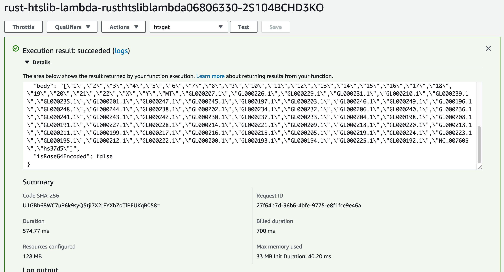

# Read BAM header on an AWS lambda with rust-htslib

This small Bioinformatics proof of concept that bundles [htslib](http://github.com/samtools/htslib) into an AWS Lambda for massive distributed computing. This only prints a BAM header, but I hope you see the massive scaling potential, hitting an S3 bucket with milions of concurrent lambdas will be interesting to see ;)

To make this work, this README assumes the following prerequisites:

1. You are already authenticated against AWS.
2. [AWS CDK](https://aws.amazon.com/cdk/) is properly installed.
3. You have a [functioning Rust(up) installation](https://rustup.rs/), docker and [`cross`](https://github.com/rust-embedded/cross).
4. You pointed [`BUCKET` and `KEY` on `main.rs`](https://github.com/brainstorm/s3-rust-htslib-bam/blob/60389d7c637ce2f8c172c64f75659a519b3c4d4b/src/main.rs#L9) towards the BAM file you want to work with.
5. Run with a proper Lambda HTTP payload (example in `deploy/lambda_test_event.json`).

### **TODO: Properly parametrize points 4 and 5 for more ergonomic operation (via cdk.json or similar?).**

If that is in order, clone this repository and build away with MUSL:

```
$ cross build --release --target x86_64-unknown-linux-musl
```

Then deploy with [AWS CDK](https://aws.amazon.com/cdk/):

```
$ cd deploy && cdk deploy
rust-htslib-lambda: deploying...
[0%] start: Publishing c59cf9536e04f460efe5bf09a3e7404d2f0dbf43be6a353e09e46c4e0b574d37:current
[100%] success: Published c59cf9536e04f460efe5bf09a3e7404d2f0dbf43be6a353e09e46c4e0b574d37:current
rust-htslib-lambda: creating CloudFormation changeset...


 ✅  rust-htslib-lambda

Stack ARN:
arn:aws:cloudformation:ap-southeast-2:<ACCT_ID>:stack/rust-htslib-lambda/33990140-a619-11ea-98e1-0a1a04ef0eac
```

And finally, invoke the lambda:

```
$ aws lambda invoke --function-name "arn:aws:lambda:ap-southeast-2:<ACCT_ID>:function:rust-htslib-lambda" response.json
{
    "StatusCode": 200,
    "FunctionError": "Unhandled",
    "ExecutedVersion": "$LATEST"
}

$ jq . response.json 
{
  "errorType": "Runtime.ExitError",
  "errorMessage": "RequestId: 1d98e743-00c8-4535-ac8b-0d4c7f2ee4a3 Error: Runtime exited with error: exit status 101"
}
```

On another (tmux) terminal, before invoking the lambda function:

```
$ cw tail -f /aws/lambda/rust-htslib-lambda
(...)
< HTTP/1.1 200 OK
< x-amz-id-2: hash 
< x-amz-request-id: hash
< Date: Tue, 30 Jun 2020 05:46:22 GMT
< Last-Modified: Thu, 07 May 2020 06:36:24 GMT
< ETag: "6dc47e886b9f2ecef870af88da3ebdd6"
< Accept-Ranges: bytes
< Content-Type: binary/octet-stream
< Content-Length: 2596799
< Server: AmazonS3
< 
* Closing connection 0
[src/main.rs:20] "BAM header targets are: {}" = "BAM header targets are: {}"
[src/main.rs:20] res = [
    "1",
    "2",
    "3",
    "4",
    "5",
    "6",
    "7",
    "8",
    "9",
    "10",
    "11",
    "12",
    "13",
    "14",
    "15",
    "16",
    "17",
    "18",
    "19",
    "20",
    "21",
    "22",
    "X",
    "Y",
    "MT",
	(...)
    "NC_007605",
    "hs37d5",
]
END RequestId: fdd85a16-f4e0-4d35-9cca-7f35c696bf21
REPORT RequestId: fdd85a16-f4e0-4d35-9cca-7f35c696bf21    Duration: 470.63 ms    Billed Duration: 500 ms    Memory Size: 128 MB    Max Memory Used: 7 MB
```

Or via the AWS web console:


